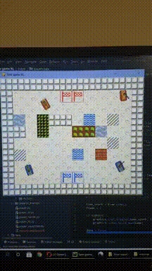
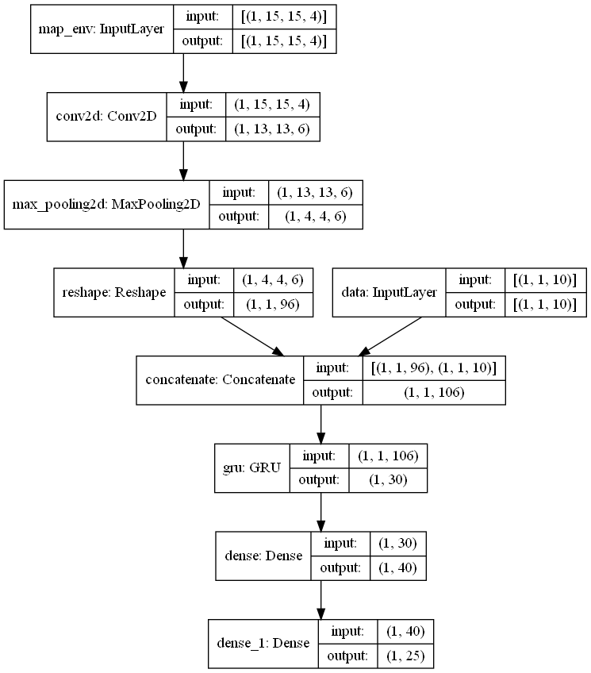

# Tank game with Reinforcement learning agents

[*Watch in Youtube*](https://youtu.be/Kww8RU3aOjo)  

This was the beginning of a project, I had a basic understanding of reinforcement learning and not a lot of experience with the SARSA algorithm.
Because of its complexity for self-study, the algorithm required tens and even hundreds of thousands of games to learn how to play this game.
The algorithm received a simplified image **15 by 15 with 4 channels**.  

Channels in input:  

    1.Objects on the map
    2.Friendly tanks
    3.Enemy tanks
    4.Projectiles / missiles
*Plus 10 informational parameters about the tank, for example, health, degree of turret angle, ammunition supply, etc.*
    
Each tank could take the following actions:

     1.Forward / backward movement
     2.Turn left / right
     3.Turn the tower left / right
     4.Shot
     5.Use skill
    
The first three actions I changed from Continious (from -1 to +1) to Discrete (choice 1 of 7 options) in which I distributed the values from -1 to +1.
The fourth action "shot" was logical, from 0 to 0.5 - not to shoot, from 0.5 to 1 - to shoot.
It turned out that the algorithm had to be able to work with parallel actions.
SARSA does not know how to do this, as a result, the algorithm did not understand exactly what action it received from it.

    I created a special mode in the game for basic training: "arena" or "shooting range". The tanks of one team were in the center, and in a circle there were enemy tanks that did not move and several more allied tanks.
     The task was to learn how to shoot at enemies.
     But in the end, the "trained" tanks simply rotated the turret in one direction and fired constantly. That is, the algorithm did not associate the joy for hitting with a precisely directed shot, but realized that he receives a reward when he shoots and turns the tower.

[*Watch in Youtube*](https://youtu.be/f2JhhmJuJPU)  
The game gave rewards for hitting the enemy, destroying the enemy, capturing the base, and winning. And penalties for hitting / destroying allies.
Because there were prizes for personal action - this simplified learning. If there was a reward only for the overall victory, then it would be more difficult for individual agents in the team to find the connection between actions and the reward.
However, the reward for hitting / destroying an enemy was delayed. After firing, the projectile reached the target after a few steps and this complicated the learning process, despite the fact that there were several parallel actions.
    
More problems that I encountered in this task:
The environment for the agent was originally developed as a game (maybe someday it will be finished) and, accordingly, the algorithm was complicated by additional calculations that slowed down the speed of the game. If I run the game without video and with 4 agents with a random policy, then on my laptop the speed reached **400 FPS**.
But when I ran deep neural network agents on **Tensorflow** the maximum speed was **35 FPS.**
To train with such data and actions, I needed up to **100,000 games** to train an agent it is impossible to do this at 35 FPS.
    
### Architecture model

---
The output is 25 values:
1. from 1 to 7 - forward / backward movement
2. 8 to 15 - turn left / right
3. from 16 to 21 - turn the tower left / right
4. 22-23 - shoot
5. 24-25 - use skill  

All 25 values are the Q value of the expected reward. For the above ranges, the largest value was selected, converted to a numerical value, and passed on as the selected action.
*For example:* we check which value from 1 to 7 is greater, for example 5. We convert to a continuous value according to the table ([-1., -0.66, -0.33, 0., 0.33, 0.66, 1.]) -> **0.33**. This means that our tank will accelerate by 0.33% of its power. And we check the distance among 8-15 values.
Binary value: compare 22 and 23 values, if 22 is greater, then it is **False** and the shot will not be fired. If the 23 value is greater, then it is **True** and the tank will shoot.

I have not seen this approach used and I cannot say whether it will work, because I did not replace the algorithm with architectures,
which can work in more complex environments.

